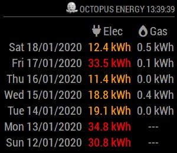

# MMM-OctoMon

"Octopus Monitor", displays energy usage history for your Octopus Energy account. Unofficial!

## Example



## Dependencies

* An installation of [MagicMirror<sup>2</sup>](https://github.com/MichMich/MagicMirror)
* An electricity and/or gas supply account with Octopus Energy and a smart electricity meter

## Installation

1. Clone this repo into `~/MagicMirror/modules` directory, to create `~/MagicMirror/modules/MMM-OctoMon`.

```
	cd ~/MagicMirror/modules
	git clone https://github.com/christopherpthomas/MMM-OctoMon.git
```

1. Add OctoMon configuration into `~/MagicMirror/config/config.js`:

```
	{
		module: 'MMM-OctoMon',
		position: 'bottom_right',
		header: ' Octopus Energy',
		config: {
				elecApiUrl: 'https://api.octopus.energy/v1/electricity-meter-points/[ELECTRIC-MPAN]/meters/[METER_SERIAL]/consumption/?group_by=day',
				gasApiUrl: 'https://api.octopus.energy/v1/gas-meter-points/[GAS-MPRN]/meters/[GAS-SERIAL]/consumption/?group_by=day',
				api_key: '[YOUR-API-KEY]',
				displayDays: 7,
				elecMedium: 10,
				elecHigh: 20,
				elecCostKWH: 0.1372,
				elecCostSC: 0.25,
				gasMedium: 5,
				gasHigh: 6,
				gasCostKWH: 0.0331,
				gasCostSC: 0.168,				
				decimalPlaces: 1,
				showUpdateTime: true,
				updateInterval: 60000*60,
				retryDelay: 5000,
				animationSpeed: 2000,
		}
	},
```

1. Obtain your API key from the Octopus Energy website, by signing into your account, then click 'Menu' -> 'My Account' -> 'Personal Details' -> 'API Access'. This page will also provide you with the electricity meter's MPAN and Serial numbers, and the gas meter's MPRN and Serial numbers, which need to be replaced above.

## Configuration options

The following config.js properties can be configured.

| **Option** | **Default** | **Description** |
| --- | --- | --- |
| 'header' | 'octobw.jpg' | other graphics available in the 'public' directory, or just remove it |
| 'displayDays' | '7' | The number of days of historical energy usage to display |
| 'elecMedium' | '10' | kWh values over this amount will be displayed in Orange |
| 'elecHigh' | '20' | kWh values over this amount will be displayed in Red |
| 'elecCostKWH' | '0.1372' | cost per kWh in pounds, or zero to hide display |
| 'elecCostSC' | '0.25' | daily standing charge in pounds |
| 'gasMedium' | '5' | kWh values over this amount will be displayed in Orange |
| 'gasHigh' | '6' | kWh values over this amount will be displayed in Red |
| 'gasCostKWH' | '0.0331' | cost per kWh in pounds, or zero to hide display |
| 'gasCostSC' | '0.168' | daily standing charge in pounds |
| 'decimalPlaces' | '1' | round all kWh values to this number of decimal places |
| 'showUpdateTime' | 'true' | true or false, to display the time the energy usage figures were last updated |
| 'updateInterval' | '60000\*60' | delay between refresing energy usage via the API, in milliseconds (1 hour, or 60 * 60 seconds) |
| 'retryDelay' | '5000' | delay between failing to get a valid result from the API and trying again in milliseconds (5 seconds) |
| 'animationSpeed' | '2000' | fade in/out speed in milliseconds (2 seconds) |

## Additional customisation

See comments in the main source code for a couple of other things that could be changed.

## Note

Cost calcuations are based on fixed daily rates. Octopus have tiered and variable pricing models (Octopus Go and Octopus Agile) which are not currently implemented. Turn the cost display off by setting the elecCostKWH or gasCostKWH to zero.

## Disclaimer

This module has been hacked together very quickly! I've taken a bunch of shortcuts, such as inserting HTML and CSS inline styles, when there's probably a more elegant way to accomplish things. Recommendations for changes welcome! It's completely unofficial, but it is using the Octopus Energy (https://developer.octopus.energy) publicly available customer API, so as far as I'm concerned, that's permission enough. Supplied AS-IS. No warranties expressed or implied. Blah bla-blah. It works on my machine!
